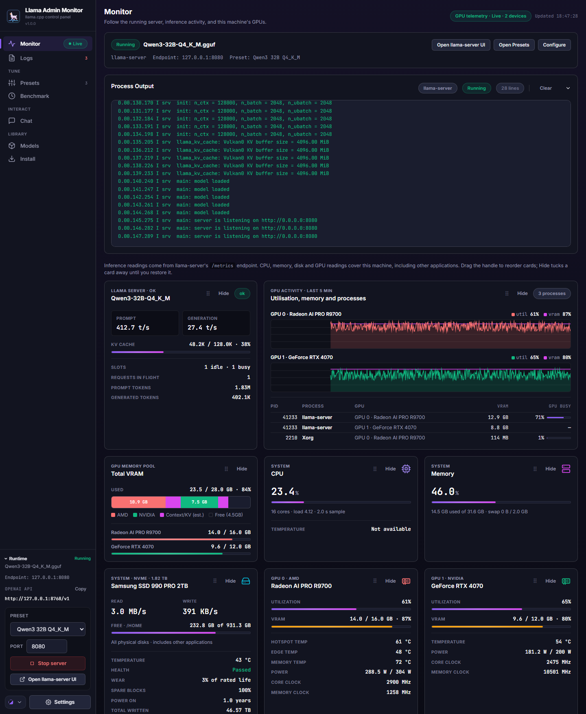
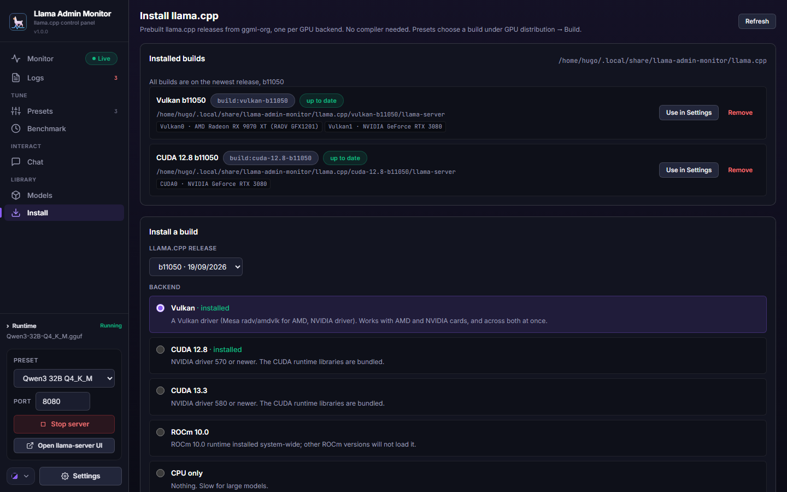
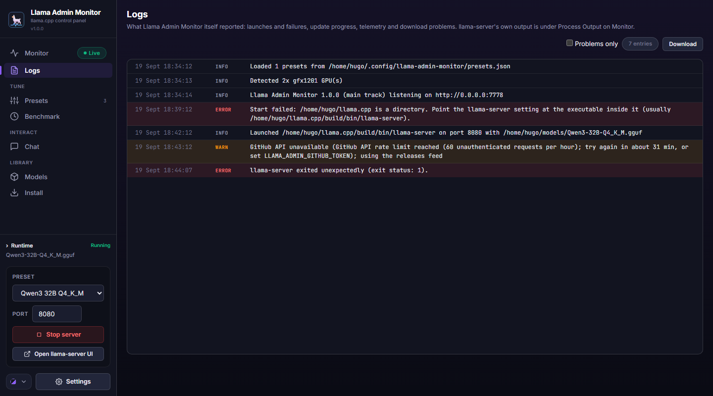
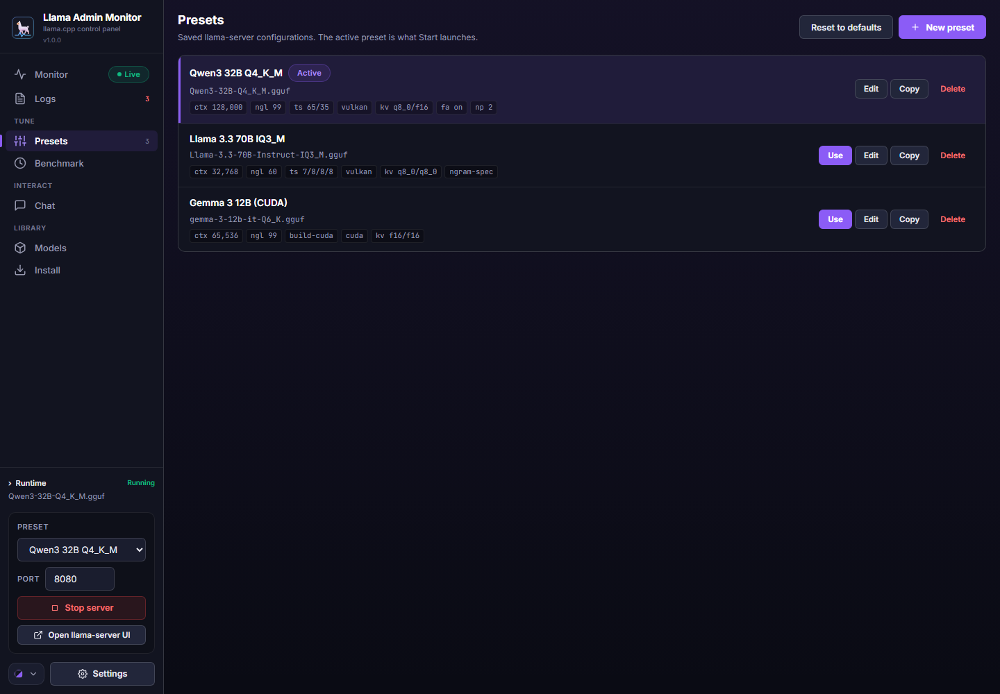
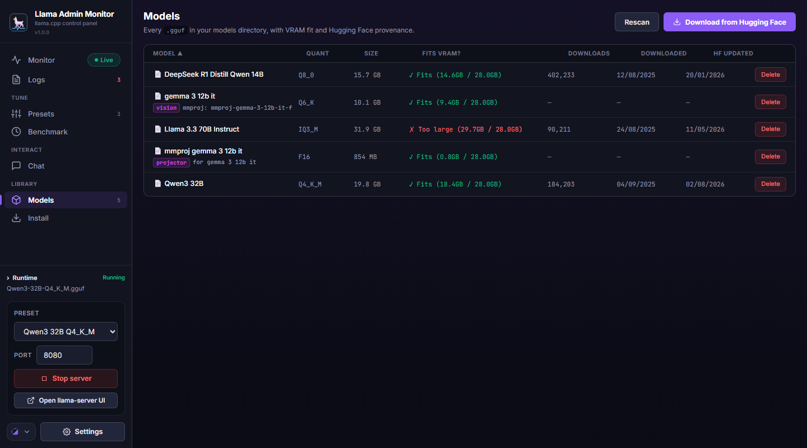
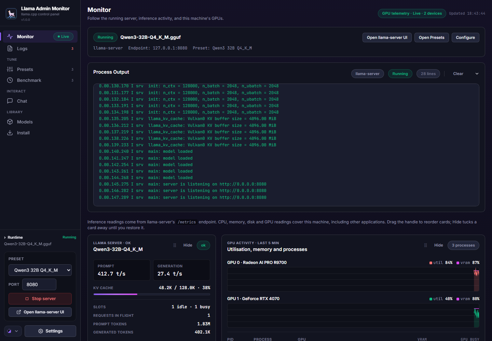
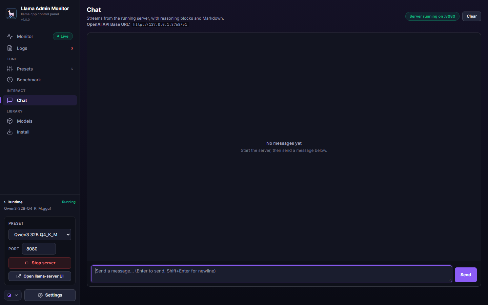
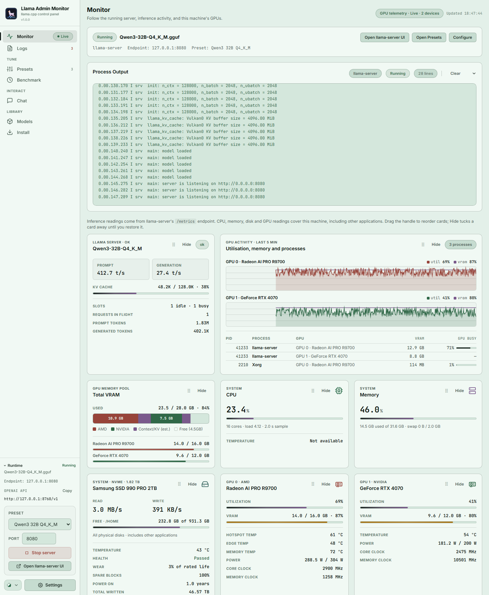

# Llama Admin Monitor

Web control panel for [llama.cpp](https://github.com/ggerganov/llama.cpp) servers: live GPU, CPU, memory and disk monitoring with an nvtop-style activity view, one-click installs of prebuilt llama.cpp builds (Vulkan, CUDA, ROCm, CPU, Metal), model management with Hugging Face downloads, multi-GPU VRAM visualisation, automated tensor-split benchmarking, an OpenAI-compatible endpoint that follows whichever model is loaded, and in-app updates — in a single self-contained Rust binary.

It began as a fork of [arte-fact/llama-monitor](https://github.com/arte-fact/llama-monitor) (extended into an admin dashboard as [ViriatusOG/llama-monitor](https://github.com/ViriatusOG/llama-monitor)) and now carries a UI modelled on [LLama-GUI](https://github.com/thomas9120/LLama-GUI): a grouped sidebar, card-based pages, and five WCAG-AA themes.

## Screenshots

Monitor, in the **Nebula** theme — inference, GPU activity with five minutes of history and the processes on each GPU, pooled VRAM, CPU, memory, the disk behind the models directory with SMART health, and one card per GPU:



| Install llama.cpp | Logs |
| --- | --- |
|  |  |

| Presets | Models |
| --- | --- |
|  |  |

| Benchmark | Chat |
| --- | --- |
|  |  |

Same dashboard in the **Mint** light theme:



## Features

### Monitoring
- **Live runtime strip** — server state, loaded model, endpoint and active preset at the top of the Monitor page, plus a persistent runtime summary in the sidebar
- **Process output** — llama-server's stderr streamed into a terminal card, with Clear
- **Logs page** — the monitor's own event log (launch failures and why, detected crashes, update progress, telemetry and download problems) with timestamps, a problems-only filter and Download
- **Inference card** — prompt/generation speed, slot status and KV-cache occupancy (with a bar that turns amber at 80 % and red at 95 %), from llama-server's Prometheus endpoint
- **VRAM usage card** — one segmented bar across every GPU, coloured per vendor (AMD, NVIDIA, Intel) with an estimated context/KV segment and free space, labelled in GB
- **One card per GPU** — utilisation and VRAM bars, temperature, power draw vs. limit (flagged when capped), core and memory clocks; AMD, NVIDIA and Intel cards are shown together. AMD cards list all three sensors rocm-smi exposes — **Hotspot** (junction, the value the card throttles on), **Edge** and **Memory** — with thresholds suited to each; NVIDIA cards show the single sensor `nvidia-smi` reports
- **GPU Activity card** — nvtop in a card: utilisation and VRAM graphs per GPU over the last five minutes, plus the processes using each GPU with their VRAM and busy share (from `nvidia-smi --query-compute-apps` and the kernel's DRM fdinfo accounting; processes of other users need the monitor to run as root)
- **CPU, Memory and Disk cards** — per-core utilisation grid and CPU model, load average, RAM and swap, populated DIMM slots with type and speed (via `dmidecode`, see below), disk read/write throughput and free space on the models volume, plus the drive's model, temperature and SMART health/wear (via `smartctl`, see below)
- **Arrange the dashboard** — drag cards by their grip (or move them with the arrow keys) and hide the ones you don't need; the layout is remembered per browser

### Server management
- **Launch from the sidebar** — pick a preset and port, Start/Stop, and open llama-server's own web UI while it runs; the button reflects live state
- **Presets page** — every saved configuration with its key parameters as chips; switch the active preset, edit, copy, delete, or reset to defaults
- **Preset editor** — collapsible sections covering every llama.cpp parameter; persisted to disk
- **Failure detection** — if llama-server exits on its own (a model that won't fit, a bad flag) the dashboard resets to a stopped state and surfaces the error on the Monitor page

### llama.cpp builds
- **Install page** — installs prebuilt llama.cpp releases from ggml-org's GitHub releases, one per backend (Vulkan, CUDA 12.8 / 13.3 with the runtime bundled, ROCm 10.0, CPU; Metal on Apple Silicon), into `~/.local/share/llama-admin-monitor/llama.cpp/<backend>-<tag>/`. Each install runs `--list-devices` and shows what it can see. Presets pick a build under *GPU distribution → Build*, so an NVIDIA-only preset can use the CUDA build while a multi-GPU preset uses Vulkan. A build can also be made the default binary in Settings with one click. Each installed build shows whether it is on the newest upstream release; **Update** installs the new tag, moves presets and Settings over and removes the old build. Upstream builds are single-backend; mixing CUDA and Vulkan devices in one process still needs a self-compiled binary with both enabled.

### Model management
- **Models page** — every `.gguf` in your models directory with quantisation, size, VRAM fit, source repo, download date and the repo's last-updated date on Hugging Face; sortable columns
- **Hugging Face downloads** — search repos, browse their `.gguf` files with sizes and a VRAM-fit check *before* downloading, then download with a live progress bar that keeps going if you close the dialog
- **Companion projectors** — repos that ship an `mmproj` file offer it as a companion; it downloads right after the model, and a preset editor that is open picks both paths up. Projectors are marked on the Models page and excluded from the benchmark picker
- **Delete** models from disk without leaving the dashboard

### Optimisation
- **Benchmark page** — sweeps tensor-split ratios, and optionally batch sizes, micro-batch sizes and thread counts, through `llama-bench`; reports prompt and generation throughput per combination, marks the fastest and applies it to a preset in one click. Large sweeps ask for confirmation with the run count; cancellable, keeping results so far

### Interface
- **Five themes** — Tokyo and Nebula (dark), Graphite (mid-tone), Cappuccino and Mint (light), picked from the sidebar and remembered per browser
- **OpenAI-compatible proxy** — everything under `/v1/*` is forwarded to the running llama-server, so clients such as SillyTavern or the OpenAI SDKs can point at `http://<monitor>:7778/v1` and follow whichever model is loaded
- **Integrated chat** — streaming chat through that proxy, with collapsible reasoning blocks and Markdown rendering
- **In-app updates** — Settings → App Updates installs the newest GitHub release for your track (stable `main` or pre-release `beta`) and restarts; see [Updates and release tracks](#updates-and-release-tracks)
- **File browser** for binaries, directories and models; **persistent settings** (preset, port, paths, models directory); **responsive** layout with a navigation drawer on phones; installable as a PWA

## Supported hardware

| Vendor | Metrics | Detection |
|--------|---------|-----------|
| AMD | `rocm-smi` | `rocminfo` |
| NVIDIA | `nvidia-smi` | `nvidia-smi` |
| Intel | `xpu-smi` | — |

Multiple vendors are monitored at once — a machine with both an AMD and an NVIDIA card gets one card per GPU. In `auto` mode each vendor tool is probed once at startup and skipped, with a single warning in the Logs page, if it fails or reports no GPUs — so a leftover `nvidia-smi` after swapping the NVIDIA card out does not spam the log. A tool that stops working later is logged once per outage and once on recovery. Override detection with `--gpu-backend rocm|nvidia|none`.

**AMD card names:** `rocm-smi` names cards from libdrm's `amdgpu.ids`, which lags new hardware and reports unknown cards as a bare "AMD Radeon Graphics". When that happens the monitor resolves the name from the PCI device id (RX 9070 XT, RX 9070, RX 9060 XT and Radeon AI PRO R9700 are built in), then from `lspci` (your system's `pci.ids`; `sudo update-pciids` refreshes it), and otherwise shows the generic name tagged with the gfx target and device id, e.g. `AMD Radeon Graphics (gfx1201, 0x7551)`. If you see that form for a card you can name, open an issue with the id.

**RDNA 4 note:** `gfx1201` (RX 9070 / 9070 XT / 9070 GRE / Radeon AI PRO R9700) requires ROCm 7.2 or newer for `rocminfo` to enumerate the GPU. The versions of `rocminfo` and `rocm-smi` in Ubuntu's default repositories predate RDNA 4 and will not detect these cards; install ROCm from AMD's repository instead.

## Installation

### Prebuilt binaries

Each [release](https://github.com/ViriatusOG/llama-admin-monitor/releases) ships static binaries for Linux (x86_64, aarch64) and macOS (x86_64, aarch64), plus a `SHA256SUMS` file. Only release binaries can update themselves from the UI; a local `cargo build` shows a `DEV` badge and leaves updating to you.

```bash
curl -fL -o llama-admin-monitor https://github.com/ViriatusOG/llama-admin-monitor/releases/latest/download/llama-admin-monitor-linux-x86_64
chmod +x llama-admin-monitor
```

### From source

```bash
# Install Rust if needed: https://rustup.rs
curl --proto '=https' --tlsv1.2 -sSf https://sh.rustup.rs | sh

git clone https://github.com/ViriatusOG/llama-admin-monitor.git && cd llama-admin-monitor
cargo build --release
```

The binary is at `target/release/llama-admin-monitor`. It's a single self-contained executable — the frontend is embedded at compile time.

### Dependencies

- **llama.cpp** — `llama-server` (with `--metrics` and `--jinja` support). `llama-bench` is required for the Benchmark page and is expected alongside `llama-server` in the same directory.
- **GPU monitoring** (optional) — `rocm-smi` / `rocminfo` (AMD) or `nvidia-smi` (NVIDIA)
- The UI loads the Inter and JetBrains Mono fonts from Google Fonts when the browser is online and falls back to system fonts otherwise.

## Quick start

```bash
# Configure paths in the web UI
./llama-admin-monitor

# Or specify them up front
./llama-admin-monitor \
  --llama-server-path /path/to/llama-server \
  --models-dir ~/models \
  --port 7778
```

Open `http://localhost:7778`. Click **Settings** in the sidebar to set your llama-server binary and models directory, create a preset on the **Presets** page, then **Start server** from the sidebar.

There is no built-in authentication. Keep it on a trusted network or behind an authenticated reverse proxy.

### Running as a service

To start the monitor at boot and keep it running, install a systemd unit that runs it as your own user (so the config directory, installed builds, the `sudo -n` rules below and the in-app updater all keep working):

```bash
sudo tee /etc/systemd/system/llama-admin-monitor.service >/dev/null <<'UNIT'
[Unit]
Description=Llama Admin Monitor
After=network-online.target
Wants=network-online.target

[Service]
Type=simple
User=youruser
WorkingDirectory=/home/youruser/llama-admin-monitor
ExecStart=/home/youruser/llama-admin-monitor/llama-admin-monitor \
  --llama-server-path /home/youruser/llama.cpp/build/bin/llama-server \
  --llama-server-cwd /home/youruser/llama.cpp/build/bin \
  --models-dir /home/youruser/models \
  --port 7778
Restart=always
RestartSec=3

[Install]
WantedBy=multi-user.target
UNIT

sudo systemctl daemon-reload
sudo systemctl enable --now llama-admin-monitor
systemctl status llama-admin-monitor
```

Logs go to the journal (`journalctl -u llama-admin-monitor -f`). In-app updates work under systemd: the new binary re-executes in place and the unit keeps supervising it.

### Memory slot details

DIMM slot, type and speed come from `dmidecode -t 17`, which needs root to read the SMBIOS tables. The monitor tries `dmidecode` and then `sudo -n dmidecode -t 17`; the second works once a passwordless sudo rule exists for exactly that command:

```bash
sudo apt install -y dmidecode
echo "$USER ALL=(root) NOPASSWD: /usr/sbin/dmidecode -t 17" | sudo tee /etc/sudoers.d/llama-admin-monitor
sudo chmod 0440 /etc/sudoers.d/llama-admin-monitor
```

Without it the Memory card still shows usage, and the slot row explains what is missing.

### Disk health

The Disk card names the physical drive behind the models directory (resolved through `findmnt`/`lsblk`, so LVM and partitions are followed to the disk) and shows its temperature, SMART health, wear, spare blocks, power-on time, total bytes written and media errors, laid out like the GPU cards. Temperature comes from the kernel's hwmon node and needs no privileges on NVMe drives (SATA drives need the `drivetemp` kernel module: `sudo modprobe drivetemp`). The SMART rows come from `smartctl -j -H -A`, which needs root; add it to the same sudoers file:

```bash
sudo apt install -y smartmontools
echo "$USER ALL=(root) NOPASSWD: /usr/sbin/dmidecode -t 17, /usr/sbin/smartctl -j -H -A /dev/*" | sudo tee /etc/sudoers.d/llama-admin-monitor
sudo chmod 0440 /etc/sudoers.d/llama-admin-monitor
```

SMART is re-read once a minute. Without the rule the card still shows throughput, free space and temperature, and the Health row explains what is missing.

## Updates and release tracks

There are two tracks. **main** is stable: SemVer tags such as `v1.0.0` publish as GitHub releases. **beta** carries new features first: zero-padded CalVer tags containing `-beta` (for example `v2026.09.22-beta.07`) publish as pre-releases. The release workflow bakes the tag and track into the binary, and **Settings → App Updates** shows both, offers the newer release on your track (a sidebar dot and a toast also announce it), and lets you switch tracks. A locally compiled build shows "local build" and can install either track's release to join it.

Installing an update downloads this platform's asset next to the running executable, checks its size and executable header, stops llama-server, replaces the binary atomically and re-executes it with the same arguments — so it works as a plain process or under systemd (`Restart=always` also covers the rare failure to re-exec). If the download or the swap fails, the running binary is left untouched and the error is shown in the dialog. The executable's directory must be writable by the user running the monitor.

Release checks are cached for five minutes (Check for updates bypasses the cache) and fall back to GitHub's Atom feed when the API rate limit is hit; set `LLAMA_ADMIN_GITHUB_TOKEN` to raise the limit. Because the monitor has no authentication, anyone who can reach its port can trigger an update — one more reason to keep it on a trusted network.

## CLI reference

| Flag | Short | Default | Description |
|------|-------|---------|-------------|
| `--llama-server-path` | `-s` | `llama-server` | Path to the llama-server binary (uses `$PATH` if a bare name) |
| `--llama-server-cwd` | | `.` | Working directory for llama-server |
| `--models-dir` | | — | Directory scanned for `.gguf` files; also the download target |
| `--port` | `-p` | `7778` | Monitor web UI port |
| `--presets-file` | | `~/.config/llama-admin-monitor/presets.json` | Custom presets file location |
| `--gpu-backend` | | `auto` | Force GPU backend: `auto`, `rocm`, `nvidia`, `none` |
| `--gpu-arch` | | from config | GPU architecture for ROCm (e.g. `gfx1100`, `gfx1201`, `auto`) |
| `--gpu-devices` | | from config | Visible GPU device indices (e.g. `0,1`) |

All paths can also be set from the Settings dialog. UI settings take precedence over CLI defaults and persist to `~/.config/llama-admin-monitor/ui-settings.json`.

### Upgrading from llama-monitor

Presets, GPU environment and UI settings are read from `~/.config/llama-admin-monitor/`. If that directory does not exist yet but `~/.config/llama-monitor/` (from the original fork) does, the old directory is used as-is, so nothing needs to be migrated. Theme choice lives in the browser and is chosen fresh.

## Tensor split format

llama.cpp expects tensor splits **slash-separated** — `65/35` for two GPUs, `7/8/8/8` for four. A comma-separated value is parsed as a single number, which silently places the entire model on the first GPU. The Benchmark page uses slashes throughout; if you're migrating presets from elsewhere, check this first when a split doesn't seem to be taking effect.

## Web UI

The sidebar groups the workspace the way LLama-GUI does:

- **Monitor** — runtime strip, process output, and the card grid: inference, GPU activity (nvtop-style), VRAM pool, CPU, memory, disk and one card per GPU. Cards can be dragged, reordered with the keyboard and hidden; a **Live** badge appears while the server runs.
- **Logs** — the monitor's own event log with a problems-only filter and Download. llama-server's own output stays in the Process Output card.
- **Tune → Presets** — the saved configurations; the active one is what the sidebar's Start button launches.
- **Tune → Benchmark** — tensor-split (and batch/thread) sweeps with one-click apply.
- **Interact → Chat** — streaming chat against the running server.
- **Library → Models** — the models directory with VRAM fit and Hugging Face provenance, download and delete.
- **Library → Install** — prebuilt llama.cpp builds per backend, with update-in-place when upstream publishes a newer tag.

The sidebar footer holds the runtime summary (endpoint and the OpenAI-compatible API URL with a Copy button), preset and port selectors, Start/Stop, the theme menu and **Settings** (paths, GPU environment, App Updates).

### Themes

Every colour in the UI comes from a token in `static/tokens.css`, and each theme is one block in that file. The palettes are ported from LLama-GUI, where they were tuned to WCAG AA contrast. Adding a theme is one entry in the `THEMES` registry in `static/theme.js` plus one token block.

| Theme | Tone |
|-------|------|
| Tokyo (default) | Dark, blue accent |
| Nebula | Deep-space dark, violet→pink→amber accent |
| Graphite | Neutral mid-tone, copper accent |
| Cappuccino | Warm light |
| Mint | Pale seafoam light |

## Preset parameters

The preset editor groups llama.cpp parameters into collapsible sections:

- **Model & memory** — model path (with file browser and HF download), multimodal projector (`--mmproj`) for vision models, GPU layers, no-mmap, mlock
- **Context & KV cache** — context size, K/V quantisation (`f16`/`q8_0`), flash attention
- **Batching & slots** — batch size, micro-batch, parallel slots
- **GPU distribution** — devices to offload to (from `llama-server --list-devices`; tick one card to keep a model off the others), tensor split, backend (Vulkan/CUDA), split mode, main GPU
- **Threading** — generation and batch thread counts
- **Rope scaling** — YaRN/linear scaling, frequency base/scale
- **Speculative decoding** — ngram-mod, draft model, draft min/max
- **Advanced** — seed, system prompt file, extra CLI args

## API reference

| Method | Path | Description |
|--------|------|-------------|
| `GET` | `/` | Dashboard HTML |
| `GET` | `/ws` | WebSocket (real-time metrics push) |
| `POST` | `/api/start` | Start llama-server with a `ServerConfig` body |
| `POST` | `/api/stop` | Stop the running server |
| `GET` | `/api/presets` | List presets |
| `POST` | `/api/presets` | Create a preset |
| `PUT` | `/api/presets/{id}` | Update a preset |
| `DELETE` | `/api/presets/{id}` | Delete a preset |
| `POST` | `/api/presets/reset` | Reset presets to defaults |
| `GET` | `/api/models` | List discovered models |
| `POST` | `/api/models/refresh` | Rescan the models directory |
| `POST` | `/api/models/delete` | Delete a model file |
| `GET` | `/api/hf/search?q=` | Search Hugging Face for GGUF repos |
| `GET` | `/api/hf/files?repo=` | List `.gguf` files in a repo |
| `POST` | `/api/hf/download` | Download a file (plus an optional `companion` projector) to the models directory |
| `POST` | `/api/bench/run` | Start a tensor-split benchmark sweep |
| `POST` | `/api/bench/cancel` | Cancel a running sweep |
| `GET` | `/api/settings` | Get persisted UI settings |
| `PUT` | `/api/settings` | Save UI settings |
| `GET` | `/api/browse?path=&filter=` | Browse the filesystem |
| `GET` | `/api/devices?backend=` | Devices `llama-server --list-devices` reports for the configured binary, `cuda`, or `build:<id>` |
| `GET` | `/api/gpu-env` | Get GPU environment config |
| `PUT` | `/api/gpu-env` | Save GPU environment config |
| `ANY` | `/v1/*` | Transparent proxy to the running llama-server's OpenAI-compatible API |
| `GET` | `/api/builds/catalog` | Upstream llama.cpp releases and the backends available for this platform |
| `GET` | `/api/builds/installed` | Installed builds with the devices each can see |
| `POST` | `/api/builds/install` | Install `{"backend", "tag"}`; progress arrives via the WebSocket |
| `POST` | `/api/builds/remove` | Remove an installed build by id |
| `POST` | `/api/builds/update` | Reinstall an installed build at the newest upstream tag; presets and Settings that used it are moved over and the old build is removed |
| `POST` | `/api/builds/use` | Point Settings at an installed build |
| `GET` | `/api/app/logs?after=N` | The monitor's own event log (entries newer than sequence N) |
| `GET` | `/api/app/update/check` | Running version/track and the latest stable and beta releases |
| `POST` | `/api/app/update/apply` | Install `{"track": "main"\|"beta"}` and restart; progress arrives via the WebSocket |

## Architecture

```
src/
  main.rs              -- Entry point: CLI parsing, wiring, tokio::main
  cli.rs               -- Clap argument definitions
  config.rs            -- AppConfig resolved from CLI args; config-dir fallback
  state.rs             -- Shared AppState, UiSettings persistence
  gpu/
    mod.rs             -- GpuMetrics, GpuBackend trait, multi-vendor detection
    rocm.rs            -- AMD via rocm-smi JSON
    nvidia.rs          -- NVIDIA via nvidia-smi CSV
    procs.rs           -- Processes per GPU (nvidia-smi compute-apps, DRM fdinfo)
    env.rs             -- GPU environment config, architecture table
    dummy.rs           -- No-op backend for headless/testing
  llama/
    metrics.rs         -- Prometheus text format parser
    server.rs          -- Subprocess management, exit detection
    poller.rs          -- Async polling loop for /health, /metrics, /slots
    bench.rs           -- llama-bench sweep runner with cancellation
    builds.rs          -- Prebuilt llama.cpp installs from ggml-org releases
  system/
    mod.rs             -- Host CPU / memory / disk sampler (/proc, df, dmidecode)
    disk.rs            -- Physical disk identity, hwmon temperature, SMART via smartctl
  update.rs            -- Release-track updater: GitHub Releases, verify, swap, re-exec
  presets/
    mod.rs             -- ModelPreset, CRUD, file persistence
  models/
    mod.rs             -- GGUF discovery, filename parsing, metadata sidecars
    hf.rs              -- Hugging Face search, file listing, downloads
  web/
    mod.rs             -- Warp route composition
    api.rs             -- REST handlers, file browser, chat proxy
    ws.rs              -- WebSocket real-time metrics push
    static_assets.rs   -- Embedded frontend
static/
  index.html           -- App shell: sidebar, pages, dialogs
  tokens.css           -- Design tokens: one palette block per theme
  style.css            -- Layout and components (colours only via tokens)
  theme.js             -- Theme registry, persistence, sidebar theme menu
  app.js               -- Navigation, WebSocket rendering, pages, dialogs
  manifest.json, sw.js, icon.svg
```

### Data flow

```
GPU (rocm-smi/nvidia-smi)  -->  GPU poller (500ms)   --> AppState
/proc, df                  -->  System poller (2s)   --> AppState
llama-server /metrics      -->  Llama poller (1s)    --> AppState
HF download / benchmark    -->  Background tasks     --> AppState
                                                          |
                                                     WebSocket (500ms)
                                                          |
                                                       Browser
```

Downloaded models get a `<filename>.meta.json` sidecar recording the source repo, the repo's download count and last-modified date, and when the file was fetched. Models without a sidecar (added by hand, or downloaded before this feature) simply show no provenance.

## Development

```bash
cargo run                    # Debug mode
cargo test                   # Run tests
cargo clippy -- -D warnings  # Lint
cargo fmt                    # Format
```

Frontend files in `static/` are embedded at compile time via `include_str!` — no Node.js or build tooling required. Rebuild after changing them.

CI (`cargo fmt --check`, `clippy -D warnings`, tests, release build) runs on pushes to `main` and `beta`.

### Releasing

Bump `version` in `Cargo.toml`, add a CHANGELOG entry, then tag:

```bash
git tag v2026.09.22-beta.01 && git push origin v2026.09.22-beta.01   # beta track (pre-release)
git tag v1.0.1 && git push origin v1.0.1                             # main track (stable)
```

The release workflow builds all four targets, writes `SHA256SUMS`, and marks tags containing `-beta` as pre-releases. Two naming schemes, one per track:

- **Stable** releases are [SemVer](https://semver.org/): `vMAJOR.MINOR.PATCH`, starting at `v1.0.0`. Set the same version in `Cargo.toml`.
- **Beta** releases are zero-padded CalVer: `vYYYY.MM.DD-beta.NN`. Padding keeps GitHub's text-sorted release list in numeric order (`beta.09` < `beta.14`, `2026.09` < `2026.10`).

The in-app updater compares versions numerically within each track and treats any SemVer stable as newer than the CalVer stables that preceded `v1.0.0`, so users on `v2026.9.20` are offered `v1.0.0`.

## Credits and licence

- Based on [arte-fact/llama-monitor](https://github.com/arte-fact/llama-monitor), extended in [ViriatusOG/llama-monitor](https://github.com/ViriatusOG/llama-monitor).
- The interface design — layout, components, the five theme palettes in `static/tokens.css` and the theme-menu behaviour in `static/theme.js` — is ported from [thomas9120/LLama-GUI](https://github.com/thomas9120/LLama-GUI), which is licensed under the GNU General Public License v3.0.

Because it includes material derived from LLama-GUI, this project is distributed under the [GNU General Public License v3.0](LICENSE).
